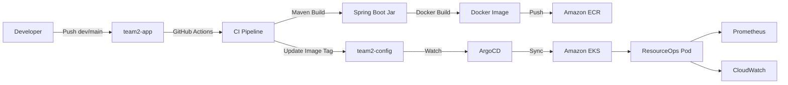

# ResourceOps

ResourceOps는 AWS EKS 환경에서 Spring Boot 애플리케이션을 GitOps 방식으로 배포하고, Prometheus와 CloudWatch metric을 기반으로 Kubernetes 리소스 비용 최적화 추천을 제공하는 프로젝트입니다.

이 저장소(`team2-app`)는 애플리케이션 소스 코드와 CI 파이프라인을 담당합니다. 배포 대상 Kubernetes manifest와 Terraform 인프라 코드는 별도 config 저장소(`team2-config`)에서 관리하며, GitHub Actions가 Docker image를 ECR에 push한 뒤 config 저장소의 Kustomize image tag를 자동으로 갱신합니다. 이후 ArgoCD가 config 저장소 변경을 감지해 EKS 클러스터에 배포합니다.

tea2-config url : https://github.com/CLD-05/team2-config.git

## 프로젝트 목표

- Spring Boot 애플리케이션을 Docker image로 빌드
- GitHub Actions와 Amazon ECR을 이용한 CI 구성
- config repo와 연동한 GitOps 배포 자동화
- Prometheus 기반 Kubernetes CPU/Memory 사용량 수집
- CloudWatch 기반 ALB/NAT 트래픽 비용 metric 수집
- 현재 request와 추천 request의 예상 비용 비교
- Kubernetes 리소스 과할당 여부 분석 및 최적화 추천 제공

## 전체 구조



## Repository 역할

### team2-app

이 저장소의 역할입니다.

- Spring Boot API 구현
- 리소스 추천 알고리즘 구현
- Prometheus metric 수집 로직 구현
- CloudWatch ALB/NAT 비용 metric 수집 로직 구현
- Dockerfile 관리
- GitHub Actions CI workflow 관리
- ECR image push
- `team2-config` 저장소의 Kustomize image tag 갱신

### team2-config

별도 config 저장소의 역할입니다.

- Kubernetes manifest 관리
- Kustomize `base`, `dev`, `prod` overlay 관리
- ArgoCD Application 관리
- Terraform 기반 AWS 인프라 코드 관리
- ServiceMonitor, ExternalSecret, Gateway API 설정 관리
- kube-prometheus-stack values 관리

## team2-app과 team2-config 연결 방식

두 저장소는 다음 방식으로 연결됩니다.

1. 개발자가 `team2-app`의 `dev` 또는 `main` branch에 push합니다.
2. `team2-app/.github/workflows/ci.yml`이 실행됩니다.
3. GitHub Actions가 Maven build를 수행합니다.
4. Docker image를 생성합니다.
5. GitHub OIDC로 AWS IAM Role을 assume합니다.
6. 생성된 image를 Amazon ECR에 push합니다.
7. GitHub Actions가 `team2-config` 저장소를 checkout합니다.
8. branch에 따라 대상 overlay를 선택합니다.
   - `dev` branch -> `apps/resource-ops/overlays/dev`
   - `main` branch -> `apps/resource-ops/overlays/prod`
9. `kustomize edit set image`로 image tag를 갱신합니다.
10. 변경된 config repo를 commit/push합니다.
11. ArgoCD가 `team2-config` 변경을 감지합니다.
12. ArgoCD가 EKS에 manifest를 sync하고 Pod를 rolling update합니다.

```text
team2-app push
  -> GitHub Actions
  -> ECR image push
  -> team2-config image tag update
  -> ArgoCD sync
  -> EKS deployment update
```
## 기술 스택

- Spring Boot 3
- Java 17
- Maven
- Docker
- GitHub Actions
- Amazon ECR

## 주요 기능

- REST API 제공
- Prometheus Metrics 노출
- RDS MySQL 연동
- 비용 최적화 추천 API
- Docker 이미지 빌드 및 ECR Push


## 프로젝트 구조

```bash
src/
 └── main/
     ├── java/
     └── resources/

Dockerfile
pom.xml
.github/workflows/

team2-app/
├── src/
│ └── main/
│ ├── java/
│ │ ├── com/example/deploylab/
│ │ └── com/example/resourceops/
│ │ ├── recommendation/
│ │ │ ├── calculator/
│ │ │ ├── cloudwatch/
│ │ │ ├── config/
│ │ │ ├── controller/
│ │ │ ├── dto/
│ │ │ ├── metrics/
│ │ │ ├── pricing/
│ │ │ ├── scheduler/
│ │ │ └── service/
│ │ └── loadtest/
│ └── resources/
│ └── application.yml
├── Dockerfile
├── pom.xml
└── .github/workflows/ci.yml
```
실행 순서

사용자 요청
    
 ↓
    
Spring Boot API
    
 ↓
    
Prometheus 조회
    
 ↓
    
CPU / Memory 사용량 분석
    
 ↓
    
리소스 추천 알고리즘
    
 ↓
    
비용 계산
    
 ↓
    
결과 저장
    
 ↓
    
응답 반환


추천 알고리즘

CPU 사용률 = 평균 CPU 사용량 ÷ CPU Request

Memory 사용률 = 평균 Memory 사용량 ÷ Memory Request

사용률이 30% 미만
 → 과할당

사용률이 30~80%
 → 적정

사용률이 80% 이상
 → 증설 권장


비용 최적화

현재 비용
      
  ↓
      
추천 리소스 적용
      
  ↓
      
예상 비용 계산
      
  ↓
      
절감액 계산
      
  ↓
      
절감률 계산


Team2-Config
```bash
team2-config/
├── apps/
│ └── resource-ops/
│ ├── base/
│ │ ├── deployment.yaml
│ │ ├── service.yaml
│ │ ├── gateway.yaml
│ │ ├── httproute.yaml
│ │ ├── configmap.yaml
│ │ ├── external-secret.yaml
│ │ ├── serviceaccount.yaml
│ │ ├── servicemonitor.yaml
│ │ ├── load-balancer-configuration.yaml
│ │ ├── target-group-configuration.yaml
│ │ └── kustomization.yaml
│ └── overlays/
│ └── dev/
│ └── kustomization.yaml
├── argocd/
├── infra/
│ ├── backend.tf
│ ├── main.tf
│ ├── variables.tf
│ ├── outputs.tf
│ └── modules/
├── monitoring/
└── platform/
├── gateway-api/
└── external-secrets/
```

